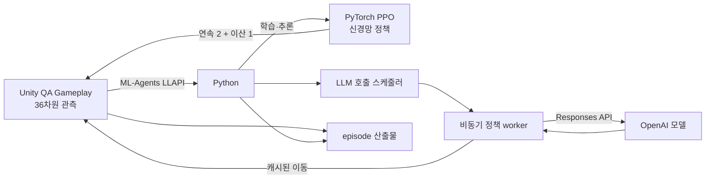

# AI 에이전트 게임 QA 가이드

이 문서는 이 저장소를 처음 사용하는 ML 엔지니어가 Unity 게임 QA를 실행하고, 결과를 판독하고, 정책을 교체할 수 있도록 설명한다. 지원 경로는 규칙 기반 smoke, ML-Agents PPO, OpenAI LLM 세 가지다.

## 경로 선택

| 경로 | 목적 | 정책 위치 | 외부 서비스 | 재현성 |
|---|---|---|---|---|
| 규칙 기반 smoke | 빌드와 게임 계약의 빠른 회귀 검사 | Unity `ScriptedQaPolicy` | 없음 | seed와 행동이 결정적 |
| PPO | 학습 및 고정 checkpoint 평가 | Python `mlagents-learn` | 없음 | checkpoint와 seed를 고정할 때 높음 |
| OpenAI LLM | 관측을 해석하는 에이전트의 행동 QA | Python `qa_llm_agent` | OpenAI Responses API | 같은 seed라도 모델 응답은 달라질 수 있음 |

smoke는 CI와 로컬 회귀 검사의 기준선이다. PPO는 보상에 따른 정책 학습에 적합하다. LLM 경로는 모델이 구조화된 게임 상태를 보고 이동 의도를 결정하는지 평가할 때 사용한다.

## 데이터 흐름



Unity의 `env.step()`은 메인 스레드를 기다리게 한다. OpenAI 요청을 그 루프에서 동기 실행하면 다음 Unity 프레임의 `Time.unscaledDeltaTime`이 요청 지연만큼 커져 `StalledGameTime`, `ModalTimeout`, `ControlBacklogExceeded` 오라클을 잘못 유발할 수 있다. 따라서 OpenAI 호출은 daemon worker에서 실행한다. LLAPI 루프는 초기 no-op 또는 마지막으로 완료된 이동을 즉시 사용하며, 새 응답은 다음 결정 tick부터 적용한다.

능력 선택은 모델 응답을 기다리지 않는다. 능력창이 열리면 Python이 4개 유효성 플래그 중 첫 번째 `true` 슬롯을 즉시 선택하고 `source=local_safety`로 기록한다. 열린 능력창에 유효 슬롯이 하나도 없으면 하니스 계약 위반으로 종료 코드 2를 반환한다.

## 사전 준비 및 검증 환경

- 현재 검증된 환경: macOS 개발 머신
- Unity `6000.0.80f1`
- [uv](https://docs.astral.sh/uv/) `0.12.x`
- Unity ML-Agents Release 23과 저장소에 고정된 Python 패키지
- LLM 경로에만 필요한 `OPENAI_API_KEY`

순수 PyTorch PPO 코드는 특정 운영체제에 종속되지 않는다. 다만 현재 제공되는 Unity player 빌드와 학습·평가 스크립트는 macOS의 `.app` 번들 및 Mach-O 실행 경로를 기준으로 검증되었다. Linux와 Windows에서는 해당 플랫폼의 Unity player 경로에 맞게 환경 어댑터와 셸 래퍼를 조정해야 한다.

Python은 `.python-version`의 `3.10.12`로 고정된다. 일반적인 PyTorch 제약이 아니라 `mlagents==1.1.0`과 `mlagents-envs==1.1.0`이 선언한 Python 상한이 `3.10.12`이기 때문이다. trainer extra는 이 ML-Agents 버전이 지원하는 최신 PyTorch `2.8.0`을 사용한다. 이후 PyTorch만 단독으로 올리면 ML-Agents의 모델 export와 trainer 호환성을 다시 검증해야 한다.

lock에는 ML-Agents 생성 코드 호환을 위한 `numpy>=1.23.5,<1.24`, `protobuf<3.21` 제약이 있다. ML-Agents 1.1.0이 제한한 `grpcio 1.48.2`에는 macOS arm64 wheel이 없으므로, 같은 1.x API를 유지하면서 CPython 3.10 universal2 wheel을 제공하는 `grpcio 1.64.1`로 override한다.

API 키는 셸 환경 변수로만 전달한다. 파일, 명령 인자, 커밋, 산출물에 키를 넣지 않는다.

## 설치와 기본 검증

저장소 루트에서 실행한다.

```sh
uv lock --check
uv sync --locked --extra trainer
uv run --locked pytest -v
```

Unity와 셸 계약도 확인한다.

```sh
scripts/qa/test-contracts.sh
scripts/qa/test-editmode.sh
scripts/qa/test-playmode.sh
```

`scripts/qa/setup.sh`는 Unity 버전과 uv lock을 함께 검증한 뒤 trainer extra까지 동기화하는 편의 명령이다.

## 플레이어 빌드와 규칙 기반 smoke

```sh
scripts/qa/build-addressables.sh
scripts/qa/build-player.sh
scripts/qa/smoke.sh
```

smoke는 기본 10개 seed를 `-qaMode=smoke`, 최대 4배속으로 실행한다. 각 프로세스는 한 에피소드에서 종료되며, 게임 시간 150초 deadline과 기본 wall-clock 60초 watchdog을 사용한다. 실패 시 summary, 행동 trace, telemetry, Unity 로그, 스크린샷이 있어야 한다.

기본 smoke 산출물 탐색 위치는 `QAArtifacts/player/QAArtifacts/`다. `QA_SMOKE_RUNTIME_ROOT`로 바꿀 수 있다.

## PPO 학습과 평가

PPO 에이전트는 OpenAI 같은 원격 LLM을 호출하지 않는다. 36개 숫자 관측을 작은 PyTorch 신경망에 입력하고, 이동 2개와 능력 선택 확률을 출력한다. 학습 중에는 Unity가 반환한 보상으로 네트워크 가중치를 반복 갱신하고, 완료 후에는 PyTorch checkpoint(`.pt`)와 Unity 추론용 ONNX 모델(`.onnx`)을 만든다. 따라서 API 비용과 네트워크 비결정성은 없지만, 유효한 정책을 얻으려면 충분한 학습 시간과 보상 설계 검증이 필요하다.

환경과 플레이어를 준비한 뒤 다음 명령을 사용한다.

```sh
scripts/qa/train.sh
scripts/qa/evaluate.sh
```

두 스크립트는 `uv run --locked --extra trainer mlagents-learn`을 사용한다. 학습 설정은 `config/qa-ppo.yaml`이며 behavior 이름은 `QaGameplay`다. 평가는 기본 seed `1234`를 trainer와 플레이어에 동일하게 적용하며 `QA_EVALUATE_SEED`로 바꿀 수 있다. `evaluate.sh`가 종료되면 uv wrapper와 trainer 자식 프로세스도 함께 정리된다.

기본 장치는 재현성과 호환성을 위한 CPU다. Apple Silicon의 MPS가 현재 PyTorch 환경에서 사용 가능할 때만 명시적으로 선택한다. 사용할 수 없는 MPS를 요청하면 실행 전에 종료 코드 2로 실패한다.

```sh
QA_TORCH_DEVICE=mps scripts/qa/train.sh
QA_EVALUATE_SEED=4321 QA_TORCH_DEVICE=cpu scripts/qa/evaluate.sh
```

학습 설정, run ID, 결과 위치는 환경 변수로 분리할 수 있다.

```sh
QA_PPO_CONFIG=config/qa-ppo.yaml \
QA_PPO_RUN_ID=qa-ppo-experiment \
QA_PPO_RESULTS_DIR=QAArtifacts/checkpoints \
scripts/qa/train.sh
```

설치와 Unity–PyTorch 통신만 빠르게 검사할 때는 `config/qa-ppo-smoke.yaml`을 사용한다. 이 설정은 256 step 통합 테스트용이며 생성 모델을 QA 점수에 사용하면 안 된다.

```sh
QA_PPO_CONFIG=config/qa-ppo-smoke.yaml \
QA_PPO_RUN_ID=qa-pytorch-smoke \
QA_PPO_RESULTS_DIR=QAArtifacts/checkpoints-smoke \
scripts/qa/train.sh
```

Release 23의 Python 환경 실행기는 macOS에서 `--env`에 내부 실행 파일이 아닌 `QaGameplay.app` 번들을 요구한다. 스크립트가 trainer에는 번들을, 직접 실행하는 평가 프로세스에는 번들 내부 Mach-O를 자동으로 전달한다.

직접 진입점을 확인하려면 다음을 실행한다.

```sh
uv run --locked --extra trainer mlagents-learn --help
```

### 순수 PyTorch PPO 예제

기존 `train.sh`와 `evaluate.sh`는 ML-Agents trainer와 ONNX export를 위한 운영 경로다. 별도 예제는 Unity 환경 어댑터, 정책 모델, PPO 학습 루프를 독립적으로 교체하려는 팀원을 위한 코드다. 기존 경로를 바꾸지 않으며 `mlagents-learn`을 호출하지 않는다.

```sh
scripts/qa/train-pytorch.sh
scripts/qa/evaluate-pytorch.sh \
  --checkpoint QAArtifacts/pytorch-ppo/checkpoint-final.pt \
  --seed 1234
```

학습 기본값은 seed `42`, 총 500,000 step, rollout 2,048 step, minibatch 256개, PPO update 3 epoch다. 작은 통신·학습 검증은 다음처럼 실행할 수 있다.

```sh
scripts/qa/train-pytorch.sh \
  --total-steps 256 \
  --rollout-steps 64 \
  --minibatch-size 64 \
  --update-epochs 1 \
  --checkpoint-interval 256 \
  --output-dir QAArtifacts/pytorch-ppo-smoke
```

두 스크립트의 첫 번째 non-option 인자는 선택적인 `QaGameplay.app` 경로다. 생략하면 `QAArtifacts/player/QaGameplay.app`을 사용한다. 장치 기본값은 CPU이며, PyTorch가 MPS 사용 가능 상태를 보고하는 경우에만 `QA_TORCH_DEVICE=mps`를 지정할 수 있다.

`qa_pytorch_ppo.environment.UnityQaEnvironment`는 관측 36개, 연속 행동 2개, 이산 branch `(5,)`, 단일 `QaGameplay` agent 계약을 확인한다. `qa_pytorch_ppo.policy.PpoPolicy`의 `act`, `evaluate_actions`, `value`를 구현하면 팀 정책을 같은 환경 및 PPO loop와 연결할 수 있다. 기본 `ActorCritic`은 tanh-squashed Gaussian 이동, Categorical 능력 선택, shared value head를 사용한다. 알고리즘 전체를 교체할 때는 `UnityQaEnvironment.reset()`과 `step(HybridAction)`만 재사용할 수 있다.

주기 checkpoint는 `checkpoint-step-NNNNNNNNN.pt`, 최종 checkpoint는 `checkpoint-final.pt`다. 기존 이름과 충돌하면 기본적으로 실패하고, `--overwrite`는 정확한 checkpoint 파일만 교체한다. 평가는 사용하지 않은 양의 seed가 필요하며 pass는 종료 코드 0, 분류된 gameplay failure는 1, 구성·통신·artifact 오류는 2다.

macOS Unity player는 상대 episode artifact를 `.app` 번들 옆에 기록하므로 평가기는 기본적으로 `<player-parent>/QAArtifacts`를 검색한다. player 실행 디렉터리를 별도로 구성한 경우에만 `--artifact-root`로 경로를 지정한다.

이 예제의 `.pt`는 Python LLAPI 평가용이다. ML-Agents가 export하는 `.onnx`와 호환되지 않으며 Unity `BehaviorParameters`에 배치할 수 없다. v1은 ONNX export, 다중 환경, TensorBoard, 재개 학습을 지원하지 않는다.

## OpenAI LLM 에이전트 실행

플레이어 빌드 후 사용하지 않은 양의 seed 하나를 선택한다.

```sh
OPENAI_API_KEY=... scripts/qa/run-llm-agent.sh --seed 9301
```

선택 인자:

```sh
scripts/qa/run-llm-agent.sh \
  --seed 9301 \
  --player QAArtifacts/player/QaGameplay.app \
  --model gpt-5.6-terra
```

LLM 경로의 플레이어 인자는 내부 Mach-O가 아니라 `.app` 번들이다. 기본 모델은 `gpt-5.6-terra`, reasoning effort는 `none`, prompt 버전은 `qa-llm/v1`이다. 정책은 OpenAI [Responses API의 Structured Outputs](https://developers.openai.com/api/docs/guides/structured-outputs)를 사용하며 원격 응답 저장은 비활성화한다.

실행기는 다음 제한을 적용한다.

| 항목 | 제한 |
|---|---:|
| OpenAI 요청 timeout | 30초 |
| API 시도 횟수 | 에피소드당 90회 |
| transient 재시도 | 최초 요청 뒤 최대 2회, 1초·2초 backoff |
| 게임 시간 deadline | 150초 |
| 전체 wall-clock watchdog | 900초 |
| Unity time scale | 1 |

429, 연결 오류, timeout, 5xx 재시도도 90회 예산에 포함된다. 구조화 출력 스키마 위반은 재시도하지 않는다. 예산 소진이나 최종 API 실패 뒤 scripted 폴백은 사용하지 않으며 인프라 실패로 종료한다.

LLM wrapper는 먼저 저장소 루트로 이동하고 Unity 프로세스는 그 CWD를 상속한다. 따라서 LLM episode는 smoke 경로와 달리 저장소 루트의 `QAArtifacts/episode-<seed>-*/`에 발행된다. 같은 seed의 episode 디렉터리가 이미 있으면 덮어쓰지 않고 실행을 거부한다.

## 관측 계약

Unity는 다음 순서의 float 36개를 전달한다.

| index | 필드 | 복원 방식과 한계 |
|---:|---|---|
| 0 | 현재 체력 비율 | `health / maxHealth`; 절대 HP 복원 불가 |
| 1 | 경험치 비율 | `experience / nextExperience`; 절대 경험치 복원 불가 |
| 2 | 플레이어 레벨 | `value × 100`; 100에서 포화 |
| 3 | 생존 여부 | 0 또는 1 |
| 4 | 유효 적 수 | `value × 8`; 이 값으로 적 슬롯 유효 범위를 판단 |
| 5–20 | 가까운 적 8개의 상대 XY | 각 축 `value × 20`; ±20에서 포화 |
| 21–23 | collectible 존재, 상대 XY | 존재하지 않으면 위치 0, 0 |
| 24–26 | chest 존재, 상대 XY | 존재하지 않으면 위치 0, 0 |
| 27–30 | 능력 슬롯 4개 유효성 | 각 0 또는 1; 능력 ID나 효과는 포함하지 않음 |
| 31 | level phase | `value × 4`: Early, Mid, Miniboss, FinalBoss, Completed |
| 32 | kill 수 | `value × 1000`; 1000에서 포화 |
| 33 | 경과 게임 시간 | `value × 600`; 600초에서 포화 |
| 34 | 누적 피해 비율 | `damageTaken / maxHealth`; 절대 피해량 복원 불가 |
| 35 | 능력창 열림 여부 | 0 또는 1 |

빈 적 슬롯의 0, 0과 플레이어와 같은 위치의 적을 좌표만으로 구분할 수 없으므로 반드시 index 4의 적 수를 사용한다. health, experience, damage는 비율만 기록하며 절대값을 추정해 만들지 않는다.

## 행동, 호출 주기, 보상

OpenAI 구조화 출력은 `movement_x`, `movement_y`, `intent` 세 필드다. 이동 성분은 각각 -1에서 1이며 Python과 Unity 양쪽에서 벡터 크기를 최대 1로 방어적으로 정규화한다.

Unity 행동 공간은 연속 이동 2개와 크기 5의 이산 branch 1개다. Python의 `ability_choice=-1..3`은 Unity에 `ability_choice + 1`로 전달된다. 즉 0은 no-op, 1–4는 슬롯 0–3이다.

ML-Agents는 50 Hz Unity에서 `DecisionPeriod=5`, 즉 게임 시간 초당 10번 결정한다. OpenAI 요청은 최초 관측, 마지막 요청 이후 2초, phase 변경 때 예약된다. 요청이 진행 중이면 중간 요청을 쌓지 않고 가장 최신 pending 관측 하나만 보존한다.

PPO 보상은 terminal pass `+10`, death/error `-2`, timeout `0`이며 level, kill, 새 phase bucket, 피해, 정체 진행량을 추가로 반영한다. LLM 경로는 이 보상으로 모델을 학습하지 않지만 동일한 Unity terminal 계약을 공유한다.

## 결과와 종료 코드

| 코드 | 의미 |
|---:|---|
| 0 | Unity summary의 outcome이 Passed |
| 1 | Unity가 분류한 게임 실패 또는 timeout |
| 2 | 설정, OpenAI, LLAPI, watchdog, summary 또는 산출물 실패 |

정상 terminal의 episode 디렉터리에는 다음 파일이 있다.

- `summary.json`: Unity terminal 결과와 replay 데이터
- `actions.jsonl`, `telemetry.jsonl`: Unity가 기록한 행동과 사건
- `llm-decisions.jsonl`: 모델/로컬 안전 결정, 관측, `requested_tick`, `applied_tick`, 응답 ID, 지연, 토큰
- `llm-run.json`: 모델, prompt 버전, API 시도 수, 총 token, outcome

Unity terminal 전에 실패하면 `QAArtifacts/llm-failures/`에 최소 실패 메타데이터를 남긴다. API 키, 원시 HTTP 본문, 숨은 추론은 어떤 LLM 산출물에도 기록하지 않는다.

## replay로 게임 동작 재현

LLM 응답은 같은 seed에서도 달라질 수 있다. 실제 게임 실행을 재현할 때는 모델을 다시 호출하지 말고 episode summary의 저장된 행동 trace를 사용한다.

```sh
scripts/qa/replay.sh QAArtifacts/episode-00009301-<run-id>/summary.json
```

replay는 저장된 seed를 먼저 적용하고 행동, discrete event, terminal outcome, 위치 허용 오차를 비교한다. 일치하면 0, 불일치하면 1을 반환한다.

## 커스텀 정책 교체

- `qa_llm_agent/policy.py`: OpenAI prompt, 구조화 출력, retry 정책
- `qa_llm_agent/async_driver.py`: 비동기 `Policy` protocol과 캐시 적용
- `qa_llm_agent/scheduler.py`: 호출 trigger와 시도 예산
- `qa_llm_agent/actions.py`: 이동 정규화와 능력창 로컬 안전 정책
- `qa_llm_agent/runner.py`: ML-Agents 환경과 단일 에피소드 생명주기

다른 모델 제공자를 연결할 때는 `AsyncPolicyDriver`가 요구하는 `decide(observation, trigger, requested_tick)` 계약을 구현하고 `PolicyResult`를 반환한다. Unity C# 관측/행동 계약, 로컬 능력 선택, LLAPI 비블로킹 조건은 유지한다.

## 비용, 보안, 비결정성

- 최대 90회는 비용 상한을 위한 API 시도 수이지 정확한 호출 횟수가 아니다. phase 변경, retry, 조기 terminal에 따라 달라진다.
- 비용은 `llm-run.json`의 입력/출력/전체 token 합계와 사용 모델의 현재 가격표로 계산한다.
- seed는 Unity 난수만 고정한다. 모델 출력, API 지연, 응답 적용 tick은 고정하지 않는다.
- `OPENAI_API_KEY`를 `.env`, shell history에 포함된 인자, 로그, issue, replay 파일에 복사하지 않는다.
- 실제 API 호출은 기본 테스트 스위트에 포함되지 않는다. 키와 빌드가 있을 때만 미사용 seed로 수동 실행한다.

## 문제 해결

- `uv.lock is missing or out of date`: `uv lock --check`로 확인하고 의존성을 의도적으로 바꾼 경우에만 `uv lock`을 실행한다.
- Python 버전 오류: `uv python install 3.10.12` 후 `uv sync --locked --extra trainer`를 다시 실행한다.
- `MPS is not available`: `QA_TORCH_DEVICE=cpu`로 실행한다. PyTorch가 MPS를 보고하는 머신에서만 MPS를 사용한다.
- `Provided filename does not match any environments`: `mlagents-learn --env`에는 번들 내부 실행 파일이 아니라 `QaGameplay.app`을 전달한다. 저장소 스크립트는 이를 자동 처리한다.
- `Episode ... already exists`: 기존 산출물을 덮어쓰지 말고 새 seed를 선택한다.
- summary가 0개 또는 여러 개: Unity 로그와 `QAArtifacts/llm-failures/`를 확인한다. runner는 정확히 하나만 허용한다.
- OpenAI timeout/429/5xx: 자동 재시도 뒤에도 실패하면 종료 코드 2다. 호출 상한을 늘려 증상을 숨기지 말고 API 상태와 네트워크를 확인한다.
- `ModalTimeout`: `llm-decisions.jsonl`에 `source=local_safety`가 기록됐는지, 관측의 능력 슬롯 유효성이 올바른지 확인한다.
- `StalledGameTime` 또는 `ControlBacklogExceeded`: OpenAI 호출이 LLAPI 메인 루프에서 실행되도록 바뀌지 않았는지 확인한다.
