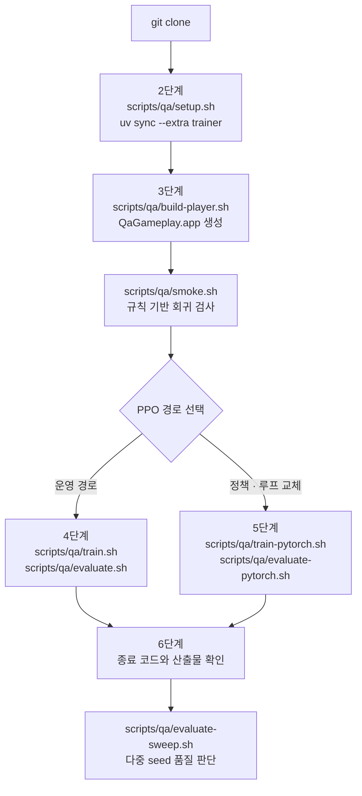

# 클론 직후 PPO 연결 quickstart

이 문서는 저장소를 방금 클론한 상태에서 PPO 학습기를 Unity 게임에 실제로 연결하기까지의 절차를 순서대로 설명한다. 각 단계에는 실행 명령, 검증 방법, 실패 시 대처가 함께 있다.

범위는 첫 학습과 평가가 성공적으로 끝나는 지점까지다. 보상 설계, 하이퍼파라미터 튜닝, LLM 에이전트 경로는 다루지 않는다. 관측 계약, 행동 공간, 보상 구조, 산출물 스키마 등 상세 계약은 [AI 에이전트 게임 QA 가이드](AI_AGENT_QA_GUIDE.ko.md)와 [QA gameplay lane](README.md)을 참조한다. 빌드한 player를 팀원에게 전달하는 절차는 [플레이어 배포](PLAYER_DISTRIBUTION.ko.md)에 있다.

## 두 PPO 경로

이 저장소에는 성격이 다른 PPO 경로가 두 개 있다. 어느 쪽을 연결할지 먼저 정한다.

| 경로 | 실행 스크립트 | 설정 위치 | 산출물 | 용도 |
|---|---|---|---|---|
| ML-Agents PPO | `scripts/qa/train.sh`, `scripts/qa/evaluate.sh` | `config/qa-ppo.yaml` | `.onnx` + `.pt` | 운영 경로. Python trainer가 붙은 상태로 추론한다 |
| 순수 PyTorch PPO | `scripts/qa/train-pytorch.sh`, `scripts/qa/evaluate-pytorch.sh` | CLI 플래그만 | `.pt` | 환경 어댑터, 정책 모델, 학습 루프를 독립적으로 교체하는 예제 |

두 경로가 만드는 `.pt`는 서로 다른 형식이다. 순수 PyTorch 경로의 checkpoint는 Python LLAPI 평가 전용이며 ML-Agents가 export하는 ONNX와 호환되지 않는다.

**ONNX를 Unity에 배치하는 경로는 아직 완성되어 있지 않다.** ML-Agents가 만드는 `.onnx`를 `BehaviorParameters`에 수동으로 지정하는 것은 가능하지만 절차가 자동화되어 있지 않고, `QaAssetGenerator.cs`가 자산을 재생성할 때 `behavior.Model = null`로 다시 지운다. 두 경로 모두 실제로는 Python 프로세스가 붙은 상태에서 추론한다.

1–3단계는 두 경로가 공통으로 필요로 한다. 4단계와 5단계에서 갈라진다.

## 프리셋

QA 환경 설정은 `config/qa-presets.json` 한 곳에 모여 있다. Unity 자산 생성기, 셸 래퍼, Python 에이전트가 모두 이 파일을 읽는다.

| | `smoke` | `train` | `eval` |
|---|---|---|---|
| level duration / miniboss | 90 / 45초 | 90 / 45초 | 90 / 45초 |
| 캐릭터 | hp ×10, armor 100 | hp ×1, armor 0 | hp ×1, armor 0 |
| 에피소드 deadline | 150초 | 150초 | 150초 |
| Unity time scale | 4배 | 20배 | 1배 |
| 관측 elapsed 스케일 | 600 | 600 | 600 |
| seed 집합 | 8201–8210 | 42 | 9101–9110 |

`-qaPreset=<name>`으로 선택하며 생략하면 `smoke`다. 따라서 `smoke.sh`, LLM 경로, replay는 인자를 추가하지 않아도 기존과 동일하게 동작한다. 세 프리셋은 캐릭터 내구도와 time scale만 다르다. **학습에는 `smoke`를 쓰지 않는다** — 내구 캐릭터는 사실상 죽지 않아 실패 보상 `-2`가 발생하지 않는다.

### 환경 지문

각 프리셋은 level 타이밍, 캐릭터 내구도, deadline, 관측 스케일에서 계산한 **환경 지문**을 갖는다.

```sh
uv run --locked python -m qa_agent_runtime.presets --preset train --key fingerprint
```

`train`과 `eval`은 지문이 같으므로 학습한 정책을 그대로 평가할 수 있다. **`smoke` 자산으로 만든 checkpoint를 평가에 넣으면 거부된다.** 관측 계약(`36 / 2 / (5,)`)은 세 프리셋이 공유하므로 지문 없이는 이 오탑재를 막을 수 없다.

## 0단계 — 전체 흐름



Unity player 빌드가 없으면 어떤 PPO 명령도 실행되지 않는다. `QAArtifacts/`와 `*.app`은 `.gitignore` 대상이므로 클론 직후 저장소에는 player가 존재하지 않는다. 3단계를 건너뛸 수 없다.

## 1단계 — 사전 조건 확인

이 문서의 1–6단계는 macOS 개발 머신을 기준으로 한다. Python CLI는 세 플랫폼을 모두 지원하지만 셸 래퍼는 macOS 전용이다. 팀원에게 빌드를 전달하는 절차와 다른 플랫폼에서의 실행 방법은 [플레이어 배포](PLAYER_DISTRIBUTION.ko.md)를 참조한다.

| 항목 | 요구 버전 | 이유 |
|---|---|---|
| Unity | `6000.0.80f1` | `scripts/qa/common.sh`의 `QA_UNITY_VERSION`과 정확히 일치해야 스크립트가 통과한다 |
| [uv](https://docs.astral.sh/uv/) | `0.12.x` | `pyproject.toml`의 `[tool.uv] required-version = ">=0.12,<0.13"` |
| Python | `3.10.12` | `mlagents==1.1.0`과 `mlagents-envs==1.1.0`이 선언한 Python 상한. PyTorch 제약이 아니다 |
| PyTorch | `2.8.0` | 고정된 ML-Agents trainer가 지원하는 최신 버전 |

Unity 기본 탐색 경로는 `/Applications/Unity/Hub/Editor/6000.0.80f1/Unity.app/Contents/MacOS/Unity`다. 에디터를 다른 위치에 설치했다면 `UNITY_EDITOR`에 에디터 실행 파일 경로를 지정한다.

확인 명령:

```sh
uv --version
/Applications/Unity/Hub/Editor/6000.0.80f1/Unity.app/Contents/MacOS/Unity -version
```

Unity 버전 문자열에 `6000.0.80f1`이 포함되지 않으면 이후 빌드 단계가 실패한다.

## 2단계 — 의존성 설치

저장소 루트에서 실행한다.

```sh
uv python install 3.10.12
scripts/qa/setup.sh
```

`setup.sh`는 세 가지를 순서대로 수행한다.

1. Unity `6000.0.80f1` 존재와 버전 일치 확인
2. uv 존재 확인과 `uv lock --check` (lock 파일이 `pyproject.toml`과 어긋나면 종료 코드 2)
3. `uv sync --locked --extra trainer`

**`--extra trainer`가 핵심이다.** `torch`와 `mlagents`는 `pyproject.toml`의 optional dependency로만 선언되어 있다.

```toml
[project.optional-dependencies]
trainer = ["mlagents==1.1.0", "torch==2.8.0"]
```

따라서 `uv sync`만 실행하면 PyTorch가 설치되지 않고 모든 PPO 명령이 `ModuleNotFoundError`로 죽는다. LLM 에이전트 경로(`run-llm-agent.sh`)는 trainer extra 없이 동작하도록 의도적으로 분리되어 있다.

검증:

```sh
uv run --locked pytest -v
uv run --locked --extra trainer python -c "import torch, mlagents_envs; print(torch.__version__)"
```

두 번째 명령의 기대 출력은 `2.8.0`이다.

lock의 `numpy`, `protobuf`, `grpcio` 제약을 임의로 완화하면 LLAPI 통신이 깨진다.

## 3단계 — Unity player 빌드

클론 직후에는 `QAArtifacts/` 디렉터리 자체가 없다. PPO 학습기가 붙을 대상인 Unity player를 먼저 만들어야 한다.

```sh
scripts/qa/build-player.sh
```

`build-player.sh`는 내부에서 `build-addressables.sh`를 먼저 호출한 뒤 player를 빌드하므로 별도로 실행할 필요는 없다. Addressables만 다시 만들고 싶을 때만 아래를 단독 실행한다.

```sh
scripts/qa/build-addressables.sh
```

Addressables는 player 빌드에 자동으로 포함되지 않으므로 반드시 이 순서를 거친다. 로컬 QA player는 Burst 컴파일을 끄고 빌드한다.

빌드 결과:

| 대상 | 경로 |
|---|---|
| `.app` 번들 | `QAArtifacts/player/QaGameplay.app` |
| 번들 내부 실행 파일 | `QAArtifacts/player/QaGameplay.app/Contents/MacOS/project_mgd_vampire` |
| Addressables 로그 | `QAArtifacts/logs/addressables.log` |
| player 빌드 로그 | `QAArtifacts/logs/player-build.log` |

`--env`에는 `.app` 번들을, 플레이어를 직접 띄울 때는 번들 내부 실행 파일을 쓴다. 저장소 스크립트가 자동으로 구분하므로 보통은 번들 경로만 신경 쓰면 된다.

검증:

```sh
scripts/qa/smoke.sh
```

smoke는 기본 10개 seed를 규칙 기반 정책으로 실행하며 학습을 포함하지 않는다. 빌드와 게임 계약이 정상인지 확인하는 기준선이다. smoke가 실패하면 PPO 연결로 넘어가지 않는다. PPO를 붙여도 원인이 학습기인지 빌드인지 구분할 수 없기 때문이다.

### 어떤 명령이 빌드를 요구하는가

player 빌드는 한 번만 하면 되고 이후 계속 재사용한다. 다시 빌드해야 하는 경우는 Unity C# 코드, 씬, 프리셋 자산을 바꿨을 때다.

| 빌드 불필요 | 빌드 필수 |
|---|---|
| `uv run --locked pytest` | `smoke.sh` |
| `scripts/qa/test-editmode.sh` | `train.sh`, `evaluate.sh` |
| `scripts/qa/test-playmode.sh` | `train-pytorch.sh`, `evaluate-pytorch.sh` |
| `scripts/qa/test-contracts.sh` | `evaluate-sweep.sh` |
| `scripts/qa/setup.sh`, `generate-assets.sh` | `replay.sh`, `run-llm-agent.sh` |

왼쪽은 코드가 계약을 지키는지만 검증한다. 게임이 실제로 그렇게 동작하는지는 빌드해서 실행해야 알 수 있다.

### 에디터에서 학습만 돌리는 경우

`--env` 없이 trainer를 띄우고 에디터에서 Play를 누르면 연결된다.

```sh
uv run --locked --extra trainer mlagents-learn config/qa-ppo.yaml --run-id=editor-check
```

다만 에디터에서는 `-qaMode`, `-qaPreset`, `-qaSeed`가 적용되지 않는다. 프리셋이 `smoke`로 잡히고 seed 지정과 평가 모드가 불가능하므로, **학습 루프가 도는지 확인하는 용도이며 QA 점수 산출이나 모델 평가에는 쓰지 않는다.**

## 4단계 — 경로 A: ML-Agents PPO 연결

### 4-1. 최소 연결 확인

전체 학습은 500,000 step이므로 오래 걸린다. Unity와 Python trainer가 실제로 통신하는지부터 256 step으로 확인한다.

```sh
QA_PPO_CONFIG=config/qa-ppo-smoke.yaml \
QA_PPO_RUN_ID=qa-ppo-connect-check \
QA_PPO_RESULTS_DIR=QAArtifacts/checkpoints-smoke \
scripts/qa/train.sh
```

`config/qa-ppo-smoke.yaml`은 통합 테스트 전용 설정이다. 이 설정으로 만든 정책을 QA 점수 산출에 사용하지 않는다.

성공하면 아래 파일들이 생긴다. 이것이 연결 성공의 증거다.

```
QAArtifacts/checkpoints-smoke/qa-ppo-connect-check/
├── configuration.yaml
├── QaGameplay.onnx                       # 최종 export 모델
├── QaGameplay/
│   ├── QaGameplay-<step>.onnx
│   ├── QaGameplay-<step>.pt
│   ├── checkpoint.pt
│   └── events.out.tfevents.*             # TensorBoard
└── run_logs/
    ├── training_status.json
    ├── timers.json
    └── Player-0.log
```

### 4-2. 전체 학습과 평가

```sh
scripts/qa/train.sh
QA_EVALUATE_SEED=4321 scripts/qa/evaluate.sh
```

`train.sh`가 실행하는 명령은 다음과 같다. 표준 출력과 표준 오류는 `QAArtifacts/logs/train.log`로 리다이렉트되므로, 학습 진행 상황은 별도 터미널에서 `tail -f` 해야 보인다.

```sh
uv run --locked --extra trainer mlagents-learn config/qa-ppo.yaml \
  --run-id=qa-ppo \
  --env=QAArtifacts/player/QaGameplay.app \
  --no-graphics \
  --torch-device=cpu \
  --results-dir=QAArtifacts/checkpoints \
  --env-args -qaPreset=train
```

`evaluate.sh`는 trainer를 `--resume --inference`로 백그라운드에 띄운 뒤 player를 `-qaMode=evaluate`로 직접 실행하고, player 종료 코드를 그대로 반환한다.

### 4-3. 환경 변수

| 변수 | 기본값 | 설명 |
|---|---|---|
| `QA_PPO_CONFIG` | `config/qa-ppo.yaml` | trainer 설정 파일. 상대 경로는 저장소 루트 기준 |
| `QA_PPO_RUN_ID` | `qa-ppo` | 결과 디렉터리 이름. `--resume` 대상도 이 값으로 결정된다 |
| `QA_PPO_RESULTS_DIR` | `QAArtifacts/checkpoints` | 결과 루트 |
| `QA_EVALUATE_SEED` | `1234` | 평가 seed. 양의 정수만 허용하며 trainer와 player에 동일 적용 |
| `QA_TORCH_DEVICE` | `cpu` | `cpu` 또는 `mps` |
| `UNITY_EDITOR` | Hub 기본 경로 | 에디터 실행 파일 |
| `UV_BIN` | `command -v uv` | uv 실행 파일 |

`train.sh`와 `evaluate.sh`의 첫 번째 위치 인자는 선택적 player 경로다. 생략하면 `QAArtifacts/player/QaGameplay.app`을 사용한다.

`config/qa-ppo.yaml`의 behavior 키는 `QaGameplay`로 유지해야 한다. Unity 씬의 `BehaviorParameters`에 설정된 이름과 일치해야 trainer가 agent를 인식한다.

기본 장치는 CPU다. MPS는 PyTorch가 사용 가능하다고 보고할 때만 선택할 수 있고, 아니면 학습 시작 전에 종료 코드 2로 실패한다.

```sh
QA_TORCH_DEVICE=mps scripts/qa/train.sh
```

## 5단계 — 경로 B: 순수 PyTorch PPO 연결

이 경로는 `mlagents-learn`을 호출하지 않는다. `qa_pytorch_ppo` 패키지가 ML-Agents LLAPI로 Unity에 직접 붙고, 환경 어댑터·정책·PPO 학습 루프를 각각 독립적으로 교체할 수 있게 구성되어 있다.

### 5-1. 최소 연결 확인

```sh
scripts/qa/train-pytorch.sh \
  --total-steps 256 \
  --rollout-steps 64 \
  --minibatch-size 64 \
  --update-epochs 1 \
  --checkpoint-interval 256 \
  --output-dir QAArtifacts/pytorch-ppo-smoke
```

성공하면 아래 형식의 한 줄이 stdout에 출력되고, `QAArtifacts/pytorch-ppo-smoke/checkpoint-final.pt`가 생성된다.

```
steps=256 updates=4 policy_loss=... value_loss=... entropy=... approximate_kl=... clip_fraction=...
```

### 5-2. 기본 학습과 평가

```sh
scripts/qa/train-pytorch.sh
scripts/qa/evaluate-pytorch.sh \
  --checkpoint QAArtifacts/pytorch-ppo/checkpoint-final.pt \
  --seed 1234
```

### 5-3. CLI 기본값

`qa_pytorch_ppo/cli.py` 기준이다.

| 옵션 | 기본값 |
|---|---:|
| `--player` | `QAArtifacts/player/QaGameplay.app` |
| `--device` | `cpu` |
| `--seed` (train) | 42 |
| `--seed` (evaluate) | 1234 |
| `--output-dir` | `QAArtifacts/pytorch-ppo` |
| `--total-steps` | 500,000 |
| `--rollout-steps` | 2,048 |
| `--minibatch-size` | 256 |
| `--update-epochs` | 3 |
| `--checkpoint-interval` | 50,000 |
| `--learning-rate` | 3e-4 |
| `--gamma` | 0.99 |
| `--gae-lambda` | 0.95 |
| `--clip-epsilon` | 0.2 |
| `--value-coefficient` | 0.5 |
| `--entropy-coefficient` | 0.005 |
| `--max-grad-norm` | 0.5 |
| `--hidden-units` | 128 |
| `--num-layers` | 2 |

옵션 전체 목록은 다음으로 확인한다. 도움말은 기본값을 표시하지 않으므로 기본값은 위 표를 본다.

```sh
uv run --locked --extra trainer python -m qa_pytorch_ppo.cli train --help
```

### 5-4. 셸 래퍼 동작

두 스크립트의 첫 번째 non-option 인자는 선택적 `.app` 번들 경로다. `-`로 시작하는 인자는 player로 해석하지 않고 그대로 Python CLI에 전달한다. `QA_PLAYER` 환경 변수로도 지정할 수 있다.

```sh
scripts/qa/train-pytorch.sh /path/to/QaGameplay.app --total-steps 4096
QA_PLAYER=/path/to/QaGameplay.app scripts/qa/evaluate-pytorch.sh --seed 5555
```

### 5-5. checkpoint 규칙

주기 checkpoint는 `checkpoint-step-NNNNNNNNN.pt`, 최종 checkpoint는 `checkpoint-final.pt`다. `--output-dir`에 `checkpoint-*.pt`가 이미 있으면 학습을 시작하지 않고 실패한다. `--overwrite`는 정확히 일치하는 checkpoint 파일만 교체하며 디렉터리나 무관한 파일은 지우지 않는다.

평가는 사용하지 않은 양의 seed를 요구한다. `--artifact-root` 아래에 `episode-<seed 8자리>-*` 디렉터리가 이미 있으면 덮어쓰지 않고 거부한다.

### 5-6. Unity 계약

`qa_pytorch_ppo/environment.py`의 `UnityQaEnvironment`는 연결 시 다음을 검증하고, 어긋나면 종료 코드 2로 실패한다.

| 항목 | 요구 값 |
|---|---|
| behavior 이름 | `QaGameplay` 하나 |
| 관측 | shape `(36,)` 하나 |
| 연속 행동 | 2 |
| 이산 branch | `(5,)` |

Unity에는 `-qaSeed=<seed>`, `-qaTimeScale=1`이 전달되고 평가 시에만 `-qaMode=evaluate`가 추가된다. 학습은 `no_graphics=True`로 실행된다.

## 6단계 — 연결 성공 판정

### 종료 코드

두 경로가 같은 규약을 사용한다.

| 코드 | 의미 |
|---:|---|
| 0 | Unity summary의 outcome이 `Passed` |
| 1 | Unity가 분류한 gameplay failure 또는 timeout |
| 2 | 설정, LLAPI 통신, checkpoint, artifact 오류 |

`evaluate-pytorch.sh`가 성공하면 다음 형식으로 출력한다.

```
seed=1234 outcome=Passed steps=... total_reward=... summary=.../summary.json
```

`outcome`이 `Passed`가 아니면 종료 코드 1이다. 이는 학습기 연결 실패가 아니라 정책이 아직 게임을 통과하지 못했다는 뜻이다. 연결 자체는 성공한 것이며, 학습 step을 늘리거나 보상 설계를 검토해야 한다. 연결 실패는 코드 2로 구분된다.

### 산출물 위치

| 내용 | 경로 |
|---|---|
| Unity, 학습, 평가 로그 | `QAArtifacts/logs/` |
| ML-Agents 결과(ONNX, TensorBoard) | `QAArtifacts/checkpoints/<run-id>/` |
| 순수 PyTorch checkpoint | `QAArtifacts/pytorch-ppo/` |
| 평가 episode 산출물 | `QAArtifacts/player/QAArtifacts/episode-<seed>-<run-id>/` |

마지막 항목에 주의한다. macOS Unity player는 상대 경로 episode 산출물을 `.app` 번들 옆에 기록한다. 그래서 `evaluate-pytorch.sh`의 `--artifact-root` 기본값이 `<player의 상위 디렉터리>/QAArtifacts`다. player 실행 디렉터리를 따로 구성한 경우에만 이 옵션을 지정한다.

episode 디렉터리에는 `summary.json`(terminal 결과와 replay 데이터), `actions.jsonl`, `telemetry.jsonl`이 있다. `summary.json`은 `scripts/qa/replay.sh`로 그대로 재현에 사용할 수 있다.

## 학습된 모델 테스트

### 어느 경로가 실제로 모델을 측정하는가

| 경로 | 명령 | 실제로 로드하는 파일 |
|---|---|---|
| ML-Agents 추론 | `scripts/qa/evaluate.sh` | `<results-dir>/<run-id>/QaGameplay/checkpoint.pt` |
| 순수 PyTorch | `scripts/qa/evaluate-pytorch.sh` | `QAArtifacts/pytorch-ppo/checkpoint-final.pt` |
| 다중 seed | `scripts/qa/evaluate-sweep.sh` | 위와 동일, seed 집합 전체 |

ML-Agents 평가가 읽는 것은 `.onnx`가 **아니라** `checkpoint.pt`다. `.onnx`는 Unity 내장 추론용으로만 export된다.

`evaluate.sh`는 player에 `--mlagents-port`를 넘겨 trainer에 연결한다. 이 인자가 없으면 비에디터 빌드의 `Academy.ReadPortFromArgs`가 `-1`을 반환해 통신 채널이 생기지 않고, `BehaviorType.Default`가 조용히 규칙 기반 정책으로 강등된다. 이를 막기 위해 `-qaMode=evaluate` 에피소드는 추론 소스가 없으면 `Error` / `NoInferenceSource`로 종료한다.

### 두 `.pt` 형식의 방어 비대칭

`qa_pytorch_ppo`와 ML-Agents의 `.pt`는 서로 다른 형식이며, **한쪽만 방어된다.**

- ML-Agents `.pt`를 `qa_pytorch_ppo`에 넣으면 `format_version` 검사에서 종료 코드 2로 거부한다.
- 반대로 `qa_pytorch_ppo` `.pt`를 ML-Agents에 넣으면 `torch_model_saver.py`의 광범위한 `except`에 걸려 **경고 한 줄만 남기고 모든 모듈을 무작위 초기화한다.** 학습된 모델을 평가한다고 믿으면서 랜덤 정책을 측정하게 된다.

`--run-id`와 `--results-dir`이 의도한 학습 결과를 가리키는지 확인한다.

### 품질 판단에 쓰는 `summary.json` 키

| 키 | 의미 |
|---|---|
| `Outcome` | `1` = Passed. 종료 코드가 반영하는 유일한 값 |
| `ReplayDiscreteEvents`의 최대 `phase:N` | `3` = FinalBoss 도달. 단일 지표로는 가장 좋은 진행도 신호 |
| `KillCount`, `FinalLevel` | 전투·성장 효율 |
| `ElapsedSeconds` | 생존 시간 |
| `DamageTaken` | 최대 체력 대비 피해 비율 |
| `EpisodeReturn` | 누적 보상. 규칙 기반 smoke에서는 0 |
| `Preset`, `PresetFingerprint` | 어느 환경에서 나온 결과인지 |

### 단일 에피소드는 표본 하나다

`evaluate.sh`와 `evaluate-pytorch.sh`는 seed 하나로 에피소드 하나를 돌린다. 모델 품질을 주장하려면 sweep을 쓴다.

```sh
scripts/qa/evaluate-sweep.sh
```

`eval` 프리셋의 seed 10개를 돌리고 outcome 분포, `phase:3` 도달률, 주요 지표의 평균과 표준편차를 `QAArtifacts/evaluate-sweep.json`에 기록한다. 에피소드가 생성되지 않거나 지문이 다른 에피소드가 섞이면 평균을 내지 않고 중단한다.

### replay는 정책을 재실행하지 않는다

```sh
scripts/qa/replay.sh QAArtifacts/episode-00001234-<id>/summary.json
```

replay 모드는 정책을 `QaReplayPolicy`로 교체해 **기록된 행동을 그대로 재생**한다. 신경망은 호출되지 않는다. 즉 게임 엔진의 결정성 검증이지 모델 재현성 검증이 아니다. 위치 비교 허용 오차는 `0.05`이며 outcome과 discrete event는 정확히 일치해야 한다.

## 커스텀 정책 연결

순수 PyTorch 경로는 정책만 교체하고 환경 어댑터와 PPO 학습 루프는 그대로 재사용할 수 있도록 설계되어 있다. `qa_pytorch_ppo.policy.PpoPolicy`의 `act`, `evaluate_actions`, `value` 세 메서드를 구현한다.

```python
from pathlib import Path

import torch

from qa_pytorch_ppo import PpoConfig, UnityQaEnvironment, train
from team_policy import TeamPolicy

# 관측 36, 연속 행동 2, 이산 branch (5,)는 Unity 계약이므로 고정이다.
policy = TeamPolicy(observation_size=36, continuous_size=2, discrete_branches=(5,))

with UnityQaEnvironment(
    player=Path("QAArtifacts/player/QaGameplay.app"),
    seed=42,
    evaluation=False,
) as environment:
    train(environment, policy, PpoConfig(), device=torch.device("cpu"))
```

기본 제공 `ActorCritic`은 tanh-squashed Gaussian 이동, Categorical 능력 선택, shared value head를 사용한다. 기본 checkpoint loader는 이 `ActorCritic`만 복원하므로, 커스텀 모델은 자체 버전 관리 checkpoint loader를 함께 준비해야 한다.

PPO 알고리즘 전체를 다른 것으로 바꾸는 경우에는 `UnityQaEnvironment.reset()`과 `step(HybridAction)`만 재사용할 수 있다.

## 문제 해결

클론 직후 실제로 마주치는 순서대로 정리했다.

| 증상 | 원인과 대처 |
|---|---|
| `uv was not found` | uv `0.12.x`를 설치하고 PATH를 확인한다. 또는 `UV_BIN`에 실행 파일 경로를 지정한다 |
| `uv.lock is missing or out of date` | `uv lock --check`로 확인한다. 의존성을 의도적으로 바꾼 경우에만 `uv lock`을 실행하고 결과를 커밋한다 |
| `Unity 6000.0.80f1 was not found` | Hub 기본 경로에 없으면 `UNITY_EDITOR`에 에디터 실행 파일 경로를 지정한다 |
| Python 버전 오류 | `uv python install 3.10.12` 후 `scripts/qa/setup.sh`를 다시 실행한다 |
| `ModuleNotFoundError: torch` | `--extra trainer`가 빠졌다. `scripts/qa/setup.sh`를 실행한다 |
| `Required Unity app bundle does not exist` | player가 없다. 3단계를 수행한다 |
| `Provided filename does not match any environments` | `--env`에 번들 내부 실행 파일이 아니라 `QaGameplay.app`을 전달한다. 저장소 스크립트는 자동 처리한다 |
| `MPS is not available in the selected PyTorch environment` | `QA_TORCH_DEVICE=cpu`로 실행한다 |
| `Checkpoint already exists in output directory` | 다른 `--output-dir`을 쓰거나 `--overwrite`를 지정한다 |
| `An episode for seed N already exists.` | 기존 산출물을 덮어쓰지 말고 사용하지 않은 seed를 선택한다 |
| `Seed must be a positive integer.` | `--seed`와 `QA_EVALUATE_SEED`는 양의 정수만 허용한다 |
| 학습이 조용히 멈춘 것처럼 보임 | `train.sh`는 출력을 `QAArtifacts/logs/train.log`로 보낸다. `tail -f QAArtifacts/logs/train.log`로 확인한다 |
| 관측/행동 계약 오류 (코드 2) | Unity 씬의 `BehaviorParameters`가 관측 36, 연속 2, 이산 `(5,)`, 이름 `QaGameplay`인지 확인한다 |
| `NoInferenceSource` | 평가에 추론 소스가 없다. trainer가 붙지 않았거나 checkpoint가 없다. `QAArtifacts/logs/evaluate-trainer.log`를 확인한다 |
| `The evaluation trainer exited before the player started` | `--resume` 대상 run이 없다. `QA_PPO_RUN_ID`와 `QA_PPO_RESULTS_DIR`이 학습 결과를 가리키는지 확인한다 |
| `UnknownQaPreset` | `-qaPreset=`에 없는 이름을 넘겼다. `uv run --locked python -m qa_agent_runtime.presets --list`로 확인한다 |
| `does not match preset 'eval'` | 다른 프리셋에서 학습한 checkpoint다. `train` 프리셋으로 다시 학습한다 |
| `Unsupported checkpoint format: 1` | 프리셋 기록 이전의 checkpoint다. 환경을 사후에 확정할 수 없으므로 재학습이 필요하다 |
| `TrainingDeadline` | 정상이다. 학습 에피소드가 150초 게임 시간에 종료된 것으로, PPO가 terminal을 받는다는 뜻이다 |
